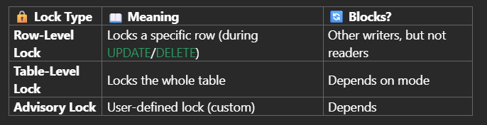
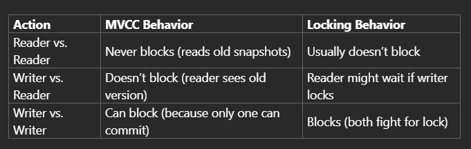
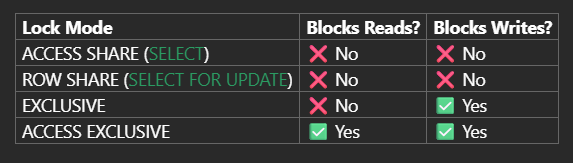

# 2025-05-13   Day - 7 PostgreSQL: Locking Mechanism, Cursor, Transactions, Triggers

# Topics
**PostgreSQL**
- Types of Locks
    - Row-Level Locking (Default Behavior) / Implicit Lock
    - Table-Level Locks / Explicit Table Lock
        - ACCESS SHARE
        - ROW SHARE
        - EXCLUSIVE
        - ACCESS EXCLUSIVE
- Deadlock
- Advisory Lock / Custom Locks
- Critical Ops

- Cursor
- Transactions
- Triggers

## Short Notes

**Locking Mechanism**
- PostgreSQL automatically applies locks, but you can control them manually when needed.

**MVCC VS Locks**
- MVCC allows readers and writers to work together without blocking.
- Locks are needed when multiple writers try to touch the same row or table.

**Simple Rule of Locks**
- Readers don’t block each other.
- Writers block other writers on the same row.

### Links 
- https://www.geeksforgeeks.org/postgresql-locks/